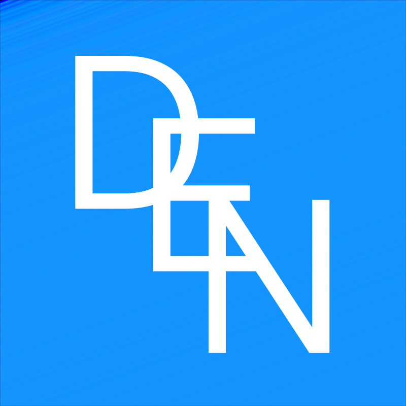

# Den Reanin Gerasimov

[;ES+%2F+RU+native+%C2%B7+EN+B2)](https://github.com/DenReanin)

---

## About

- 🎓 **MSc in Cybersecurity** + **BSc in Multimedia Engineering** — University of Alicante
- 🔐 Web application security: **DAST · OWASP Top 10 · pentesting · secure development**
- 🛠️ Author of **[Gung12](https://github.com/DenReanin/gung12)** — Python DAST scanner, 12 OWASP categories
- 🏅 **HCIA-Security V4.0** (Huawei) · Cisco Intro to Cybersecurity & Networking Devices
- 🌍 Spanish · Russian (native) — English · Valencian (B2)

---

## Featured

> **Gung12** — DAST specialized in web forms: **12 OWASP categories** (SQLi, XSS, SSTI, XXE, NoSQLi, CSRF…), **SPA support** (Angular/React/Vue) via Playwright, AI-assisted triage, WAF-bypass mode and CI/CD exit codes. Cross-platform binaries in [Releases](https://github.com/DenReanin/gung12/releases).

---

## Stack

---

## Stats

⚡ Always building — currently sharpening skills on TryHackMe & Hack The Box

